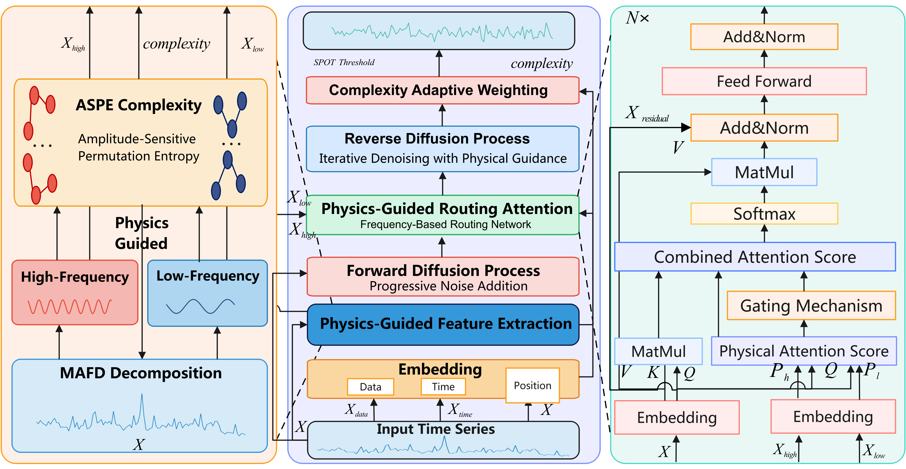

# PhysDiff: A Physically-Guided Diffusion Model for Multivariate Time Series Anomaly Detection


---


<div align="center">

<a href="https://github.com/peteli25">Long Li</a><sup>1,^</sup>, Wencheng Zhang<sup>1, ^</sup>, Shi Yuan<sup>1,^</sup>, Hongle Guo<sup>2</sup>, Wanghu Chen<sup>1,*</sup>

<p>
<sup>1</sup>College of Computer Science & Engineering, Northwest Normal University / Gansu, China

<sup>2</sup>School of Management, Northwest Normal University / Gansu, China
</p>

**NeurIPS 2025**

[[Paper latest](https://openreview.net/pdf?id=ElTbpJp7b9)]
</div>

---

<p style="text-align: justify;">Unsupervised anomaly detection of multivariate time series remains challenging in complex non-stationary dynamics, due to the high false-positive rates and limited interpretability. We propose PhysDiff, combining physics-guided decomposition with diffusion-based reconstruction, to address these issues. The physics-guided signal decomposition is introduced to disentangle overlapping dynamics by isolating high frequency oscillations and low frequency trends, which can reduce interference and provide meaningful physical priors. The reconstruction through conditional diffusion modeling captures deviations from learned normal behavior, making anomalies more distinguishable. Notably, PhysDiff introduces an amplitude-sensitive permutation entropy criterion to adaptively determine the optimal decomposition depth, and automatically extract adaptive frequency components used as explicit physics-based constraints for the diffusion process. Furthermore, the proposed conditional diffusion network employs a dual-path conditioning mechanism that integrates high-frequency and low-frequency physical priors, dynamically regulating the denoising process via a novel time frequency energy routing mechanism. By weighting reconstruction errors across frequency bands, our method improves anomaly localization and enhances interpretability. Extensive experiments on five benchmark datasets and two NeurIPS-TS scenarios demonstrate that PhysDiff outperforms 18 state-of-the-art baselines, with average F1 score improvements on both standard and challenging datasets. Experimental results validate the advantages of combining principled signal decomposition with diffusion-based reconstruction for robust, interpretable anomaly detection in complex dynamic systems.</p>

## ✨ Features

- We propose a physically-guided diffusion model that effectively addresses non-stationarity challenges.
- We introduce an amplitude-sensitive permutation entropy guided decomposition mechanism that dynamically determines optimal decomposition depth.
- We develop a dual-path conditional diffusion framework with a novel frequency-based routing attention mechanism.

## 📋 Requirements

- Python 3.10+
- PyTorch 2.1+
- NumPy
- Pandas
- SciPy
- Scikit-learn
- Matplotlib

## 📊 Data Preparation

Organize your dataset in the following structure:

```
dataset/
└── YOUR_DATASET/
    ├── YOUR_DATASET_train_data.npy  # Training data (normal samples)
    ├── YOUR_DATASET_train_date.npy  # Training timestamps (optional)
    ├── YOUR_DATASET_test_data.npy   # Test data
    ├── YOUR_DATASET_test_date.npy   # Test timestamps (optional)
    └── YOUR_DATASET_test_label.npy  # Test labels (0: normal, 1: anomaly)
```

## 🏃‍♂️ Usage

### Basic Training and Testing

```bash
python main.py --dataset YOUR_DATASET
```

### Advanced Options

```bash
python main.py \
  --dataset YOUR_DATASET \
  --data_dir ./dataset/ \
  --model_dir ./checkpoint/ \
  --batch_size 64 \
  --epochs 20 \
  --window_size 64 \
  --model_dim 512 \
  --mafd_components 6 \
  --lambda_aspe 0.2 \
  --time_steps 1000 \
  --t 500 \
  --block_num 2 \
  --head_num 8 \
  --q 0.01 \
  --visualize
```

### Parameter Description

| Parameter | Description |
|-----------|-------------|
| `--dataset` | Dataset name |
| `--data_dir` | Data directory path |
| `--model_dir` | Directory to save models and results |
| `--epochs` | Number of training epochs |
| `--batch_size` | Training batch size |
| `--lr` | Learning rate |
| `--window_size` | Size of sliding window |
| `--hidden_dim` | Hidden dimension size |
| `--physics_dim` | Physics feature dimension |
| `--mafd_components` | Number of MAFD components |
| `--lambda_aspe` | Weight for ASPE loss |
| `--time_steps` | Number of diffusion steps |
| `--q` | Risk level for SPOT algorithm |
| `--visualize` | Enable result visualization |

## 💡 Model Architecture



The PhysDiff model consists of three main components:

1. **Physics-Guided Feature Extraction**:  We extract interpretable features via adaptive multi-scale signal decomposition, capturing both transient dynamics and long-term trends.

2. **Physically-Informed Diffusion Model**: We employ a conditional generative diffusion process incorporating these physical priors to robustly learn the distribution of normal patterns

3. **Physics-Driven Anomaly Detection**: where anomalies are detected by contrasting reconstructed signals against observed data, with mechanisms sensitive to both point anomalies and sequence-level pattern deviations.

## 📂 Project Structure

```
PhysDiff/
├── data/
│   ├── dataset.py          # Dataset class for loading data
│   └── preprocess.py       # Data preprocessing functions
├── models/
│   ├── aspe.py             # Amplitude-Sensitive Permutation Entropy
│   ├── attention.py        # Attention mechanisms
│   ├── block.py            # Transformer blocks
│   ├── decomposition.py    # Dynamic decomposition for time series
│   ├── detector.py         # Main anomaly detection model
│   ├── diffusion.py        # Diffusion model implementation
│   ├── embedding.py        # Embedding layers
│   ├── mafd.py             # Multi-channel Adaptive Fourier Decomposition
│   ├── reconstruction.py   # Signal reconstruction module
│   └── subtraction.py      # Offset subtraction module
├── utils/
│   ├── earlystop.py        # Early stopping implementation
│   ├── evaluate.py         # Evaluation metrics and functions
│   ├── seed.py             # Random seed utilities
│   ├── spot.py             # SPOT algorithm for thresholding
│   └── visualization.py    # Visualization utilities
├── exp/
│   └── solver.py           # Experiment solver
├── main.py                 # Main script for running experiments
└── requirements.txt        # Project dependencies
```

## 📊 Evaluation and Visualization

After running the model, results will be displayed in the console:

```
=============== Results for YOUR_DATASET ===============
Precision: 0.9245
Recall: 0.8764
F1-Score: 0.8998
=======================================
```

If the `--visualize` flag is enabled, visualizations will be saved to the `checkpoint/` directory:


## 📜 License

This project is licensed under the MIT License - see the LICENSE file for details.

## 🙏 Acknowledgments

- This work builds upon advances in diffusion models for time series
- The SPOT algorithm implementation is adapted from the anomaly detection literature

## 📝 Citation

If you use this code in your research, please cite:

```bibtex
@inproceedings{PhysDiff_2025,
 author = {Li, Long and Zhang, Wencheng and Yuan, Shi and Guo, Hongle and Chen, Wanghu},
 booktitle = {Advances in Neural Information Processing Systems},
 doi = {10.52202/085713-3531},
 editor = {D. Belgrave and C. Zhang and H. Lin and R. Pascanu and P. Koniusz and M. Ghassemi and N. Chen},
 pages = {105720--105750},
 publisher = {Curran Associates, Inc.},
 title = {PhysDiff: A Physically-Guided Diffusion Model for Multivariate Time Series Anomaly Detection},
 url = {https://proceedings.neurips.cc/paper_files/paper/2025/file/980ea04d23d1f6908964eba2a74afe45-Paper-Conference.pdf},
 volume = {38, Main Conference},
 year = {2025}
}
```

## 📧 Contact

For questions or support, please open an issue on the GitHub repository or contact the authors.
